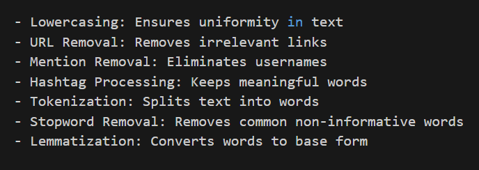
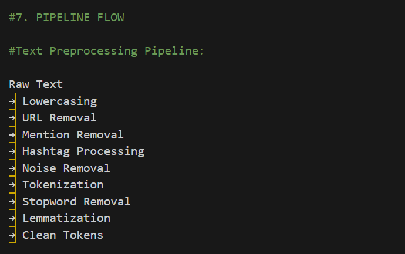
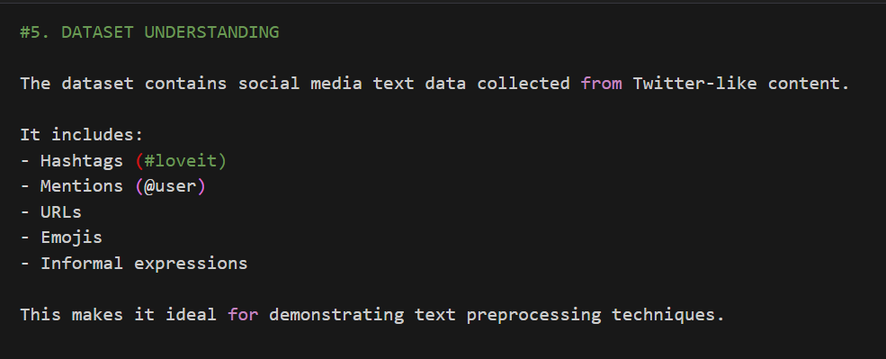
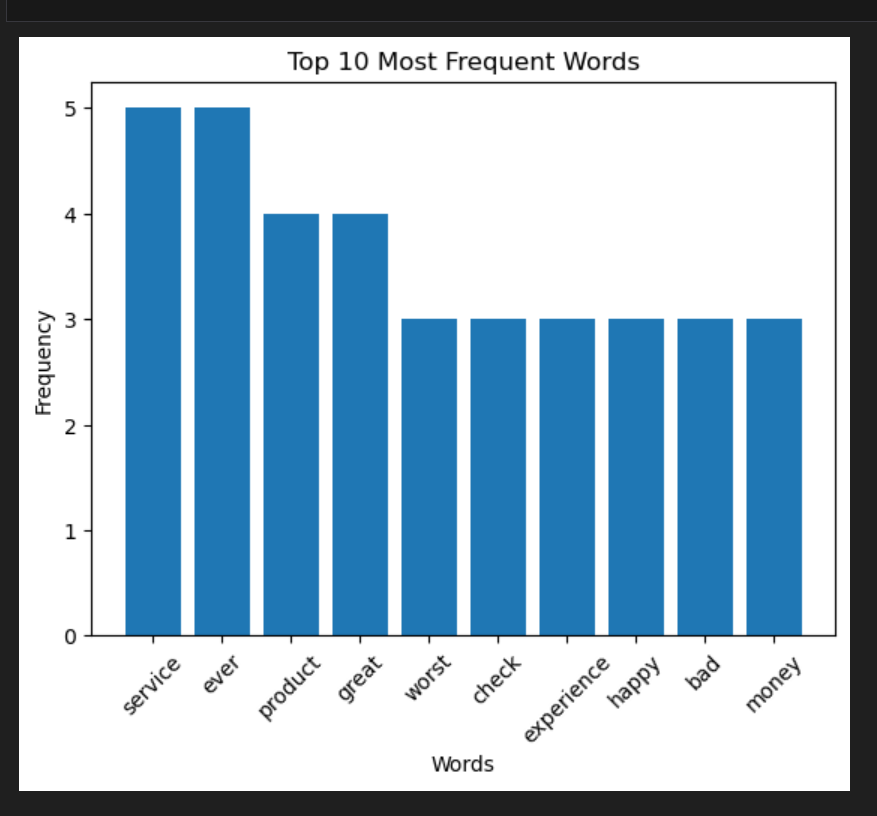
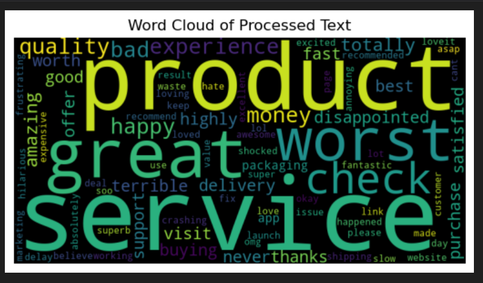
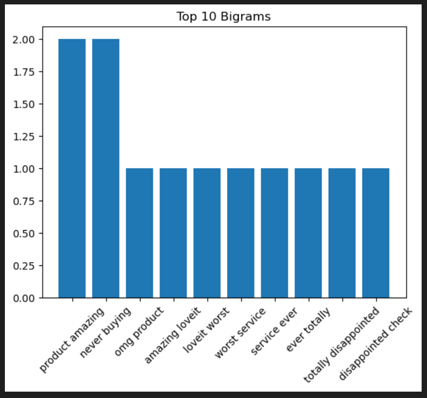

#  Text Preprocessing Pipeline for Social Media Data


A complete NLP-based text preprocessing pipeline for cleaning, normalizing, and analyzing noisy social media data using Python, NLTK, and visualization techniques.

##  Project Overview

This project presents a complete **Text Preprocessing Pipeline** for cleaning and transforming noisy social media text into a structured format suitable for Natural Language Processing (NLP) tasks. The pipeline focuses on preprocessing Twitter-like social media data by removing unwanted elements, standardizing text, and preparing it for downstream analytics such as sentiment analysis, text classification, and machine learning.

The project demonstrates the importance of text preprocessing in improving data quality and extracting meaningful insights from unstructured textual data. It includes data cleaning, text normalization, tokenization, lemmatization, and visualization techniques to better understand the processed dataset.

> **Project Type:** Academic NLP Project  
> **Domain:** Text Analytics / Natural Language Processing  
> **Programming Language:** Python

---

##  Project Objectives

- Clean and preprocess noisy social media text.
- Remove URLs, mentions, hashtags, emojis, punctuation, and other unwanted characters.
- Convert text into a standardized format suitable for NLP tasks.
- Apply tokenization, stopword removal, and lemmatization.
- Generate visualizations to understand text patterns.
- Build a reusable preprocessing pipeline for future NLP applications.

---

##  Table of Contents

- [Project Overview](#-project-overview)
- [Project Objectives](#-project-objectives)
- [Dataset Information](#-dataset-information)
- [Technologies Used](#-technologies-used)
- [Project Workflow](#-project-workflow)
- [Text Preprocessing Pipeline](#-text-preprocessing-pipeline)
- [Project Structure](#-project-structure)
- [Results and Visualizations](#-results-and-visualizations)
- [Future Scope](#-future-scope)
- [Repository Contents](#-repository-contents)
- [Author](#-author)

---

#  Dataset Information

The project uses a **Twitter-like social media dataset** containing noisy textual data with informal language, hashtags, mentions, URLs, emojis, abbreviations, and punctuation.

### Dataset Characteristics

- **Dataset Name:** twitter_large_sample.csv
- **Data Type:** Social Media Text
- **Source:** Simulated Twitter Dataset
- **Format:** CSV
- **Language:** English
- **Primary Feature:** Raw Text

### Dataset Contains

- Tweets
- URLs
- User Mentions
- Hashtags
- Emojis
- Special Characters
- Informal Expressions

---

#  Technologies Used

| Category | Technologies |
|----------|--------------|
| Programming Language | Python |
| Development Environment | Jupyter Notebook |
| Data Manipulation | Pandas |
| NLP Library | NLTK |
| Regular Expressions | re |
| Visualization | Matplotlib |
| Text Visualization | WordCloud |
| Dataset Format | CSV |

---

#  Skills Demonstrated

- Text Preprocessing
- Natural Language Processing (NLP)
- Data Cleaning
- Text Normalization
- Tokenization
- Stopword Removal
- Lemmatization
- Regular Expressions (Regex)
- Exploratory Text Analysis
- Data Visualization

#  Project Workflow

The complete workflow followed in this project is illustrated below.

<p align="center">

</p>

The workflow demonstrates the complete pipeline from loading raw social media data to generating clean text and meaningful visualizations.

---

#  Text Preprocessing Pipeline

The preprocessing pipeline used in this project follows a systematic sequence of text cleaning operations.

<p align="center">

</p>

### Pipeline Steps

1. Load Dataset
2. Convert Text to Lowercase
3. Remove URLs
4. Remove User Mentions
5. Process Hashtags
6. Remove Special Characters & Emojis
7. Tokenization
8. Stopword Removal
9. Lemmatization
10. Generate Clean Text

---

#  Data Understanding

Before applying preprocessing techniques, the dataset was explored to understand its structure and identify common sources of noise such as URLs, hashtags, mentions, emojis, and special characters.

<p align="center">

</p>

The initial exploration helped identify the cleaning requirements and guided the design of the preprocessing pipeline.

---

#  Before vs After Text Preprocessing

The preprocessing pipeline transforms noisy social media text into a clean and structured format suitable for NLP tasks.

<p align="center">

</p>

### Key Transformations

- Converted all text to lowercase
- Removed URLs and hyperlinks
- Removed user mentions (@username)
- Processed hashtags while preserving meaningful words
- Removed punctuation and special characters
- Removed stopwords
- Applied lemmatization
- Generated clean and normalized text

---

#  Word Frequency Analysis

The most frequently occurring words in the cleaned dataset were identified after preprocessing.

<p align="center">

</p>

This visualization highlights the dominant terms present in the processed social media data.

---

#  Word Cloud Visualization

A Word Cloud was generated to visualize the most frequently occurring words in the cleaned corpus.

<p align="center">

</p>

Larger words indicate higher frequency, providing a quick overview of the dominant topics within the dataset.

---

#  Bigram Analysis

Bigram analysis identifies commonly occurring pairs of words after preprocessing.

<p align="center">

</p>

This analysis helps reveal contextual relationships between frequently co-occurring terms and provides deeper insight into text patterns.

---

#  Project Structure

```text
Text-Preprocessing-Pipeline-for-Social-Media-Data/
│
├── README.md
│
├── dataset/
│   └── twitter_large_sample.csv
│
├── notebook/
│   └── Text_Preprocessing_Pipeline.ipynb
│
├── images/
│   ├── before_vs_after.png
│   ├── bigram_analysis.png
│   ├── data_understanding.png
│   ├── preprocessing_pipeline.png
│   ├── project_workflow.png
│   ├── word_cloud.png
│   └── word_frequency_bar_chart.png
│
├── presentation/
│   └── Text_Preprocessing_Pipeline_Presentation.pdf
│
└── report/
    └── Text_Preprocessing_Pipeline_Report.pdf
```

#  Key Features

- Complete end-to-end text preprocessing pipeline
- Automated text cleaning and normalization
- Tokenization and stopword removal
- Lemmatization using NLTK
- Word frequency analysis
- Word Cloud visualization
- Bigram analysis
- Reusable preprocessing workflow for NLP applications

---

#  Results Summary

The preprocessing pipeline successfully transformed noisy social media text into a structured and analysis-ready format. Key preprocessing techniques significantly improved text quality by removing irrelevant content while preserving meaningful information.

The generated visualizations—including word frequency analysis, word cloud, and bigram analysis—provided valuable insights into the cleaned corpus and demonstrated the effectiveness of the preprocessing workflow.

---

#  Future Scope

Possible future enhancements include:

- Sentiment Analysis
- Text Classification
- Topic Modeling
- Named Entity Recognition (NER)
- Spam Detection
- Fake News Detection
- Deep Learning-based NLP Models
- Transformer Models (BERT, RoBERTa)

---

#  Repository Contents

-  Dataset
-  Project Images
-  Jupyter Notebook
-  Project Presentation
-  Project Report
-  README Documentation

---

#  Author

**Ayush Raj**

MBA | Data Analytics | Python | SQL | Power BI | Excel | NLP

---

## ⭐ If you found this project helpful, consider giving this repository a Star!

